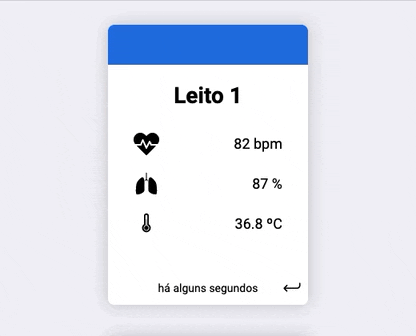
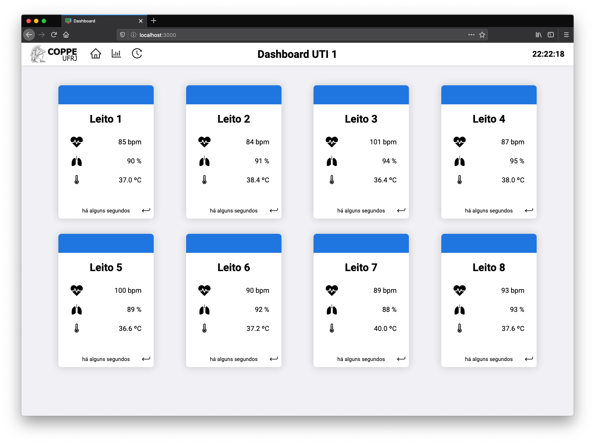
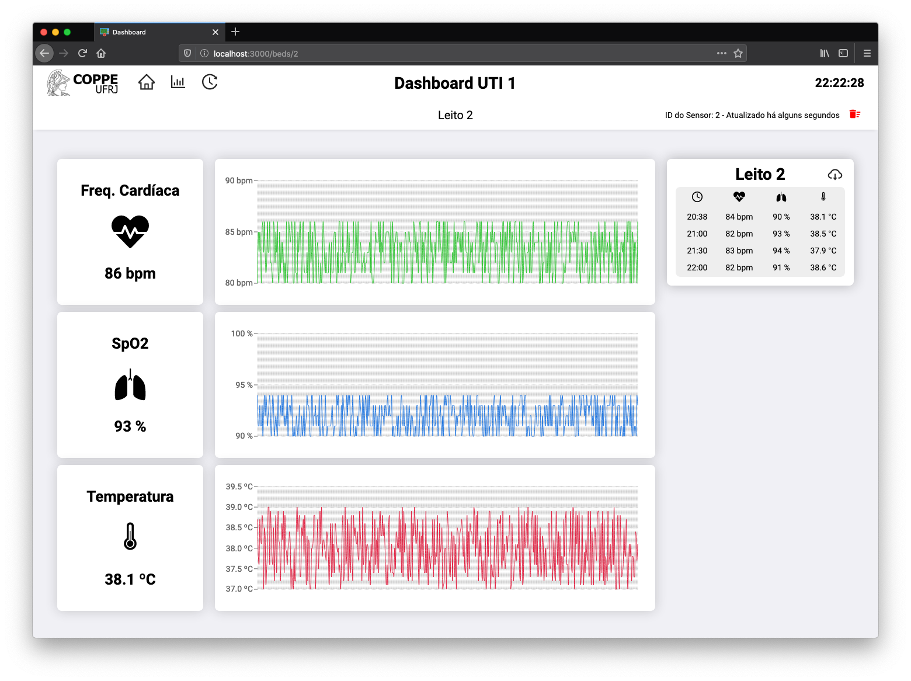
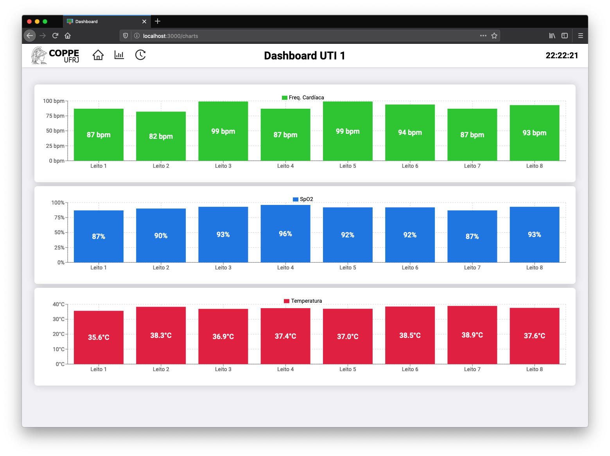
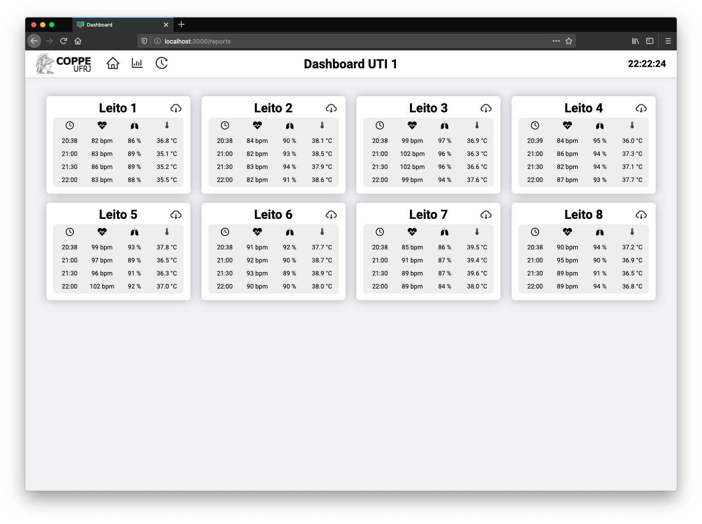

# Monitoring Dashboard (Covid-19)

Solution developed in [React](https://reactjs.org) aimed at assisting patient monitoring especially in the context of Covid-19.

[Features](#features) •
[Screenshots](#screenshots) •
[Getting Started](#getting-started) •
[Deployment](#deployment) •
[Real-Time Data](#real-time-data) •
[Authors](#authors) •
[License](#license)



## Features

* Easy-to-view monitoring dashboard for all hospital beds  
* Monitoring card with real-time information and recent interval statistics  
* Detailed view of a hospital bed (with line charts)  
* Visualization of hospital beds through bar charts  
* Viewing and exporting individual hospital bed reports  
* Display of toast alerts received through the Manager  

## Screenshots

Dashboard Home Page | Detailed Hospital Bed | Bar Charts Visualization | Reports Page
:------------------:|:---------------------:|:------------------------:|:------------:
|||

For more screenshots and gifs access the [screens.md  file](screens.md).

## Getting Started

#### Prerequisites

* [Node](https://nodejs.org) (with npm)

#### Installing Dependencies

To run the app in the development mode or build the app, you need to install the app's dependencies.

```shell
npm install
```

#### Running in the development mode

The app settings can be changed in the `public/settings.js` file.

```shell
npm start
```

Runs the app in the development mode.  
Open [http://localhost:3000](http://localhost:3000) to view it in the browser.

## Deployment

```shell
npm run build
```

Builds the app for production to the `build` folder.

After that the app settings can be changed in the `build/settings.js` file.

Your app is ready to be deployed!

See the react section about [deployment](https://facebook.github.io/create-react-app/docs/deployment) for more information.

## Real-Time Data

Real-time data is obtained with a publish-subscribe pattern through a communication with a Manager.

Settings, such as the Manager's address, can be changed through the `settings.js` file mentioned in the previous sections.

The data obtained follows the topic names and patterns presented below:

* Topic name: **`oximeters/:id`**  
Message pattern:

    ```json
        {
            "beat": number,
            "spo2": number,
            "temp": number
        }
    ```

* Topic name: **`alerts/:id`**  
Message pattern:

    ```json
        {
            "alertType": number
        }
    ```

## Authors

[](https://github.com/DamascenoRafael)
 [](https://github.com/Maasouza)

## License

Usage is provided under the GNU General Public License v3.0.  
See [LICENSE](LICENSE) for details.
