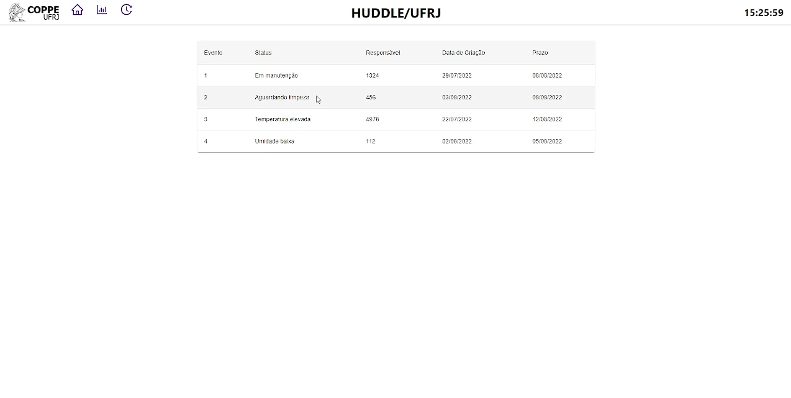
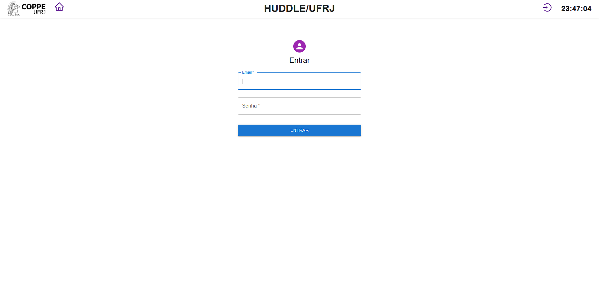

# Huddle Dashboard

This project is a implementation of a dashboard of the Huddle project: a hospital data automation and visualization project designed to meet the needs of the UFRJ University Hospital.

This project consists in the creation of a digital interface for the up-to-date visualization of the hospital resources in order to assist the hospital staff. The data to be collected and visualized by the interface are: temperature and humidity of the rooms with stored materials and status of the decks in relation to equipments.

The first page consists in the comum page, intended for use by nurses and other professionals who have tasks related to maintenance and cleaning of equipment and materials. On this screen, all pending tasks to be done that were submitted by the manager will be displayed.

 

On this same screen, you have the user login option.

 

After authentication, the manager enters the screen with the relevant information regarding materials and equipment through cards as shown in the following image.

 

The manager, in addition to being able to create tasks to be manually displayed on the common screen, can click on warnings that will appear on the screen below the cards and add tasks based on the warnings.

 

The manager can also re-view the task pane and edit current tasks at any time.

## Implementation

This project was bootstrapped with [Create React App](https://github.com/facebook/create-react-app).

In the project directory, you can run:

### `npm start`

Runs the app in the development mode.\
Open [http://localhost:3000](http://localhost:3000) to view it in your browser.

The page will reload when you make changes.\
You may also see any lint errors in the console.

### `npm test`

Launches the test runner in the interactive watch mode.\
See the section about [running tests](https://facebook.github.io/create-react-app/docs/running-tests) for more information.

### `npm run build`

Builds the app for production to the `build` folder.\
It correctly bundles React in production mode and optimizes the build for the best performance.

The build is minified and the filenames include the hashes.\
Your app is ready to be deployed!

See the section about [deployment](https://facebook.github.io/create-react-app/docs/deployment) for more information.

### `npm run eject`

**Note: this is a one-way operation. Once you `eject`, you can't go back!**

If you aren't satisfied with the build tool and configuration choices, you can `eject` at any time. This command will remove the single build dependency from your project.

Instead, it will copy all the configuration files and the transitive dependencies (webpack, Babel, ESLint, etc) right into your project so you have full control over them. All of the commands except `eject` will still work, but they will point to the copied scripts so you can tweak them. At this point you're on your own.

You don't have to ever use `eject`. The curated feature set is suitable for small and middle deployments, and you shouldn't feel obligated to use this feature. However we understand that this tool wouldn't be useful if you couldn't customize it when you are ready for it.
